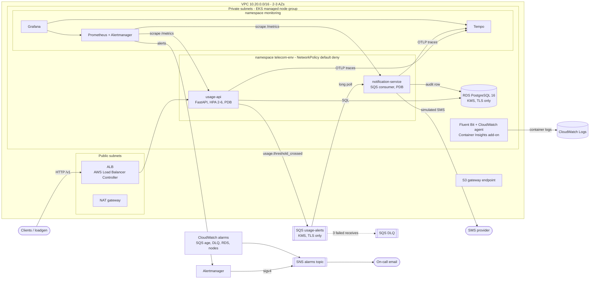
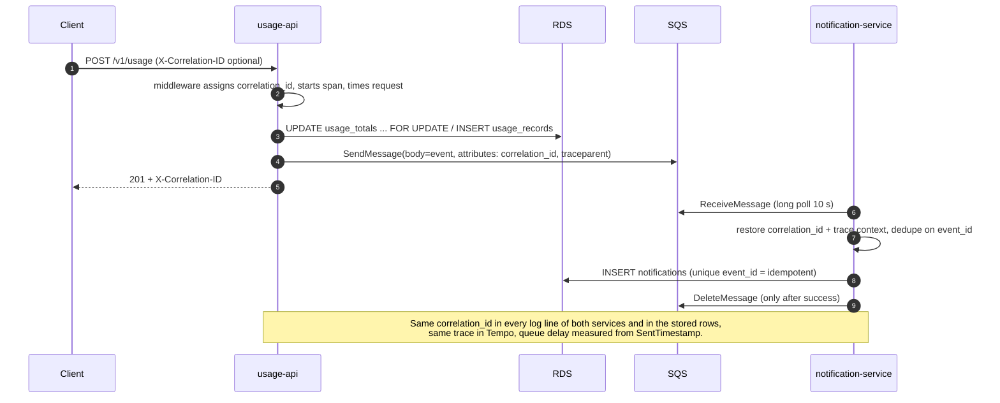
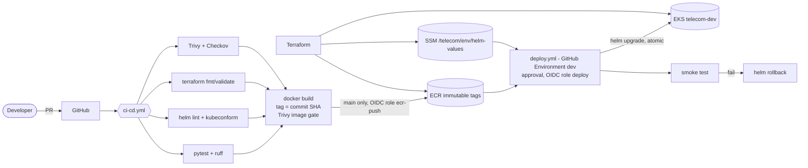

# Architecture

Telecom usage-alerts platform on Amazon EKS, built so that an outage can be traced to **one layer**:
load balancer, Kubernetes, application code, queue, database or network. Diagrams are Mermaid (GitHub renders them).

## 1. Runtime (AWS, one environment)

| Layer | Component | Failure signal (where you see it) |
|---|---|---|
| Edge | ALB (Ingress, only `/v1` routed) | ALB 5xx / target health (CloudWatch), API 5xx ratio (Grafana) |
| Kubernetes | EKS, HPA, PDB, probes, NetworkPolicy | `up`, pod restarts, failed nodes alarm, Container Insights |
| Application | usage-api, notification-service | SLO burn-rate alerts, p95 latency, error ratio, logs by correlation ID |
| Queue | SQS + DLQ | queue age / backlog / DLQ alarms, produced-vs-consumed panel, `NotificationConsumerStalled` |
| Database | RDS PostgreSQL | DB p95 query time (app metric), RDS CPU / connections / storage alarms, slow-query log |
| Network | VPC, NAT, endpoints | VPC flow logs, ALB vs app latency comparison on the triage dashboard |

## 2. One request, end to end (correlation ID and trace)

## 3. Delivery (CI/CD) and identity

No long-lived AWS keys exist anywhere: GitHub Actions exchanges its OIDC token for short-lived role credentials,
and each role trusts one claim only (`ref:refs/heads/main` to push images, `environment:<env>` to deploy).
Pods get AWS access through IRSA roles bound to one service account each.

## 4. Where things are defined

| Concern | Code |
|---|---|
| AWS infrastructure | `terraform/` (modules: network, eks, ecr, sqs, rds, irsa, github_oidc, observability, security, kms) |
| Kubernetes workloads | `charts/telecom-app/` (values-dev / values-prod; AWS wiring comes from Terraform via SSM) |
| Cluster add-ons | `terraform/scripts/install-addons.sh` + `observability/k8s/*.yaml` |
| Alert rules and dashboards | `charts/telecom-app/files/rules`, `charts/telecom-app/files/dashboards` (same files used locally) |
| CloudWatch alarms, dashboard, Logs Insights queries | `terraform/modules/observability` |
| Pipeline | `.github/workflows/` |
